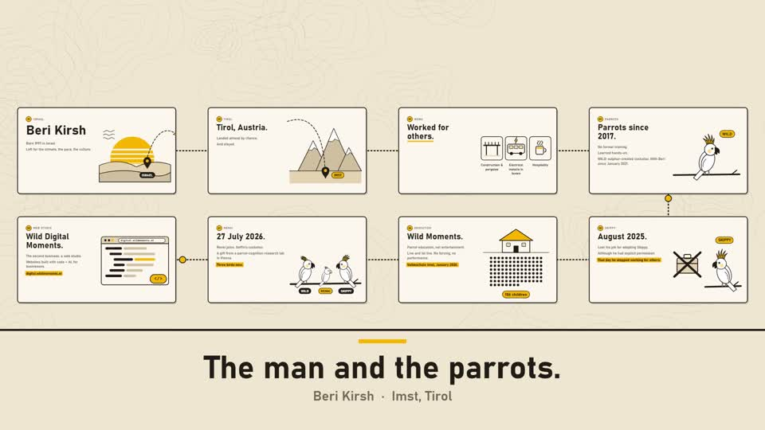
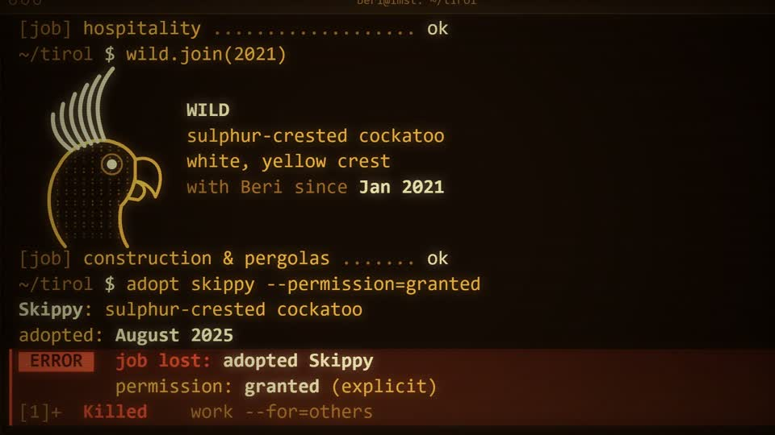
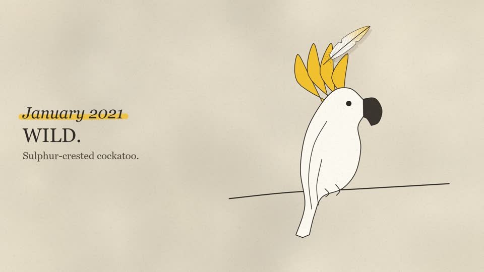

# code-animations

A Claude Code skill for making videos where a program draws every frame. The model writes one HTML file: a canvas, a timeline, and a score built with Web Audio. A small harness seeks that file frame by frame in headless Chrome and pipes the frames into ffmpeg. You get an MP4 in 16:9, 9:16, 4:5 or 1:1 from the same timeline, and the source stays editable code. To change a moment, change the numbers and render again.

The idea comes from Addy Osmani's post "how browsers work in 40 seconds" (LinkedIn, September 2026), where Claude Opus 5.5 wrote the JavaScript that drew every frame. He didn't publish his tooling, so this skill is one way to do it, with a determinism check and a QA pass built in.

| Map (world camera) | Terminal | Feather |
|---|---|---|
|  |  |  |

These three frames are from the first three films made with the skill. Each tells the same short biography in its own visual style, runs 36 to 40 seconds, and ships in 16:9 and 9:16. Every shape, bird and sound in them is drawn or synthesized by code. There are no image or audio assets.

## Install

```bash
git clone https://github.com/beriki770-ship-it/code-animations ~/.claude/skills/code-animations
```

Claude Code picks the skill up from `SKILL.md`. To use it in one project only, clone it into `<project>/.claude/skills/code-animations` instead.

Requirements:
- Node 18 or newer
- ffmpeg with libx264, aac and the blackdetect, freezedetect and ebur128 filters. Most builds include these.
- Chrome or Chromium. The harness looks in the usual install locations on Windows, macOS and Linux. Set `CHROME=/path/to/chrome` to point it elsewhere.
- bash for `qa.sh`. On Windows, Git Bash works.

## Use

Ask Claude Code for an animated explainer, for example: "use code-animations to make a 30 second 9:16 video explaining how DNS works". The skill tells it to write a storyboard first, build the densest frame first, and then verify, render and review the result.

The harness also works on its own:

```bash
mkdir anim && cp -r ~/.claude/skills/code-animations/harness anim/harness
cd anim/harness && npm install && cd ..
cp ~/.claude/skills/code-animations/example/browser-10s/index.html work.html

node harness/verify.mjs work.html --format 9x16          # same pixels on forward, backward and cold seeks
node harness/audio.mjs  work.html --twice                # score has the exact length and is deterministic
node harness/render.mjs work.html --format 16x9 --out out/work-16x9.mp4
bash harness/qa.sh out/work-16x9.mp4 4                   # black/freeze/loudness checks + contact sheets
```

A work follows one contract: `window.__anim = { duration, fps, width, height, canvas, ready, seek(t), renderAudio(), marks, shots }`. `seek(t)` has to be a pure function of `t`. That rule is what makes the frame-by-frame render and the verify check possible. `SKILL.md` has the full contract, the multi-format layout rules, the sound recipes, and the list of defects that earlier builds ran into.

## What's inside

- `SKILL.md`: the method Claude follows.
- `harness/`: `render.mjs`, `verify.mjs`, `shoot.mjs`, `audio.mjs`, `qa.sh`. The only dependency is `puppeteer-core`.
- `example/browser-10s/`: a small working piece with three scenes and push transitions. Start new works from this one.
- `example/browsers-40s/`: a 40 second explainer with a world camera and a score on a beat grid.

Known limitation: scene 3 of `browser-10s` is laid out for 16:9 and 9:16 only. At 4:5 the pixel grid and the tagline overlap.

## Contributing

Issues and pull requests are welcome. If you change the harness, run `verify`, `audio --twice` and a short `render` on `example/browser-10s` before you open a PR. CI runs the same checks.

## Credits and license

Built by Beri Kirsh ([Wild Digital Moments](https://digital.wildmoments.at/)) with Claude.
The idea is from Addy Osmani. The design of the skill was informed by [riso-windowseat](https://github.com/sevenevesai/riso-windowseat) (MIT, used as a reference; no text was copied), HeyGen HyperFrames and Remotion.

MIT. See [LICENSE](LICENSE).
